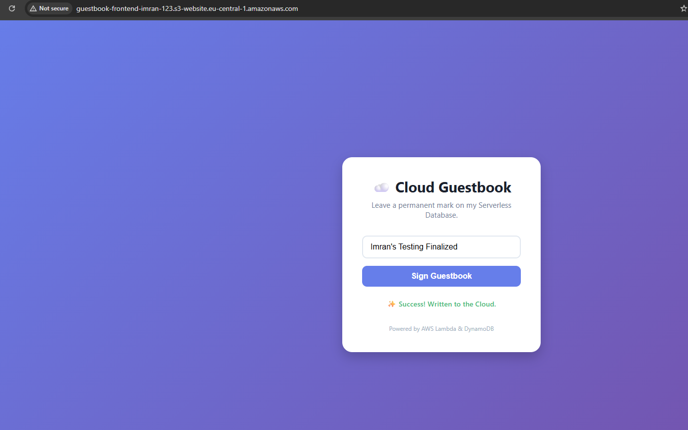
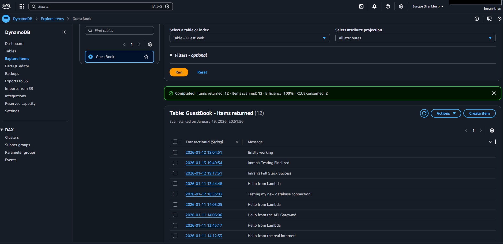

# AWS Serverless Guestbook Application

A full-stack serverless web application built on Amazon Web Services (AWS). This project demonstrates a decoupled architecture using a static frontend hosted on S3, a RESTful API gateway, serverless compute via Lambda, and a NoSQL database for persistence.

## Project Overview

The goal of this project was to build a scalable, cost-efficient web application that solves the "idle server" problem. Unlike traditional server-based architectures that incur costs 24/7, this application utilizes an event-driven serverless model where costs are only incurred when a user interacts with the system.

### Architecture

The application follows a standard serverless pattern:

1.  **Frontend (Client):** A responsive HTML/CSS/JavaScript web page hosted on **Amazon S3** with Static Website Hosting enabled.
2.  **API Layer:** **Amazon API Gateway** serves as the public entry point, securely exposing a REST API endpoint.
3.  **Compute Layer:** **AWS Lambda** (Python runtime) processes the incoming requests. It handles data parsing, timestamp generation, and CORS headers.
4.  **Database Layer:** **Amazon DynamoDB** provides low-latency, NoSQL storage for the guestbook entries.

## Visual Proof of Concept

### 1. Frontend Integration
The user interface successfully connects to the backend API. Below is the confirmation that the asynchronous fetch request received a 200 OK response from the Lambda function.

### 2. Database Persistence
Verification that the data payload was successfully parsed by the backend and stored in the DynamoDB table with a server-side timestamp.

## Technical Implementation Details

### API Gateway & CORS
To allow the browser-based frontend to communicate with the API from a different domain, Cross-Origin Resource Sharing (CORS) was strictly configured. The API Gateway handles the OPTIONS preflight request, while the Lambda function injects the necessary `Access-Control-Allow-Origin` headers into the response.

### Lambda Logic (Python)
The backend logic handles:
-   **Event Parsing:** Extracting the JSON body from the API Gateway proxy event.
-   **Timestamping:** Generating a server-side timestamp (`datetime.now`) to ensure accurate ordering of records.
-   **Error Handling:** Managing `try/except` blocks to return 500 status codes if database writes fail.

### DynamoDB Schema
-   **Table Name:** GuestBook
-   **Partition Key:** TransactionId (String)
-   **Capacity Mode:** On-Demand (Serverless)

## How to Deploy

Since this project utilizes AWS managed services, the deployment steps are as follows:

1.  **DynamoDB:** Create a table named `GuestBook` with a partition key of `TransactionId`.
2.  **Lambda:** Create a Python function with permissions (`AmazonDynamoDBFullAccess`) to write to the table. Deploy the script found in `lambda_function.py`.
3.  **API Gateway:** Create a REST API. Create a resource `/submit` and a POST method integrated with the Lambda function. Enable CORS.
4.  **Frontend:** Update `index.html` with the Invoke URL. Create an S3 bucket, upload the file, and enable Static Website Hosting.

## Future Improvements
-   **Infrastructure as Code (IaC):** Migrating the manual console configuration to Terraform or AWS CloudFormation for reproducible deployments.
-   **Authentication:** Adding AWS Cognito to restrict guestbook entries to signed-in users.
